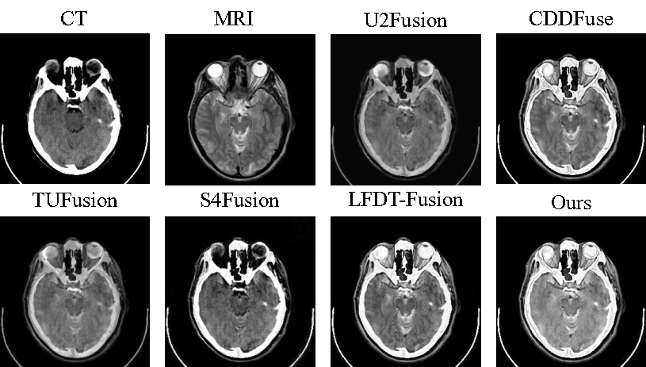

# FSIDFusion
Codes for ***Feature Space Interaction Decomposition Fusion (FSIDFusion)***  

[Shiqian Wan], [De Cheng], [Nannan Wang], [Xinbo Gao]

-[*[Paper]*]()  
-[*[ArXiv]*]()  
-[*[Supplementary Materials]*]()  

## Update
- [2025/9] Release training and inference code for FSIDFusion.

## Citation


## Abstract
Multi-modality image fusion (MMIF) aims to fully utilize the complementary information from infrared and visible image to generate fused outputs that retain the advantages of both modalities. To address the challenge of unified feature representation for multi-modality images, we propose a Feature Space Interactive Decouposition image fusion (FSIDFusion) method based on feature space analysis. Firstly, our feature extractor is built upon the Restormer architecture, mapping cross-modality images into a high-dimensional latent space. We then apply two separate encoders, based on Transformer and CNN receptive fields, to preliminarily extract the overlapping (modality-shared) and non-overlapping (modality-specific) components in the feature space. To further extend the overlap of modality-shared features, we introduce a feature interaction module based on reversible neural networks to enhance cross-modal correlations. Furthermore, a reconstruction-based fine-tuning regularization loss is proposed to alleviate feature drift caused by task discrepancies in the two-stage reconstruction–fusion training framework. Extensive experimental results demonstrate that our FSIDFusion model achieves excellent performances on various datasets and tasks, including infrared-visible image fusion, medical image fusion, downstream object detection and semantic segmentation tasks.
## 🌐 Usage
**1. Virtual Environment**

```
# create virtual environment
conda create -n fsidfusion python=3.8
conda activate fsidfusion
# select pytorch version yourself
# install requirements
pip install -r requirements.txt
```

**2. Network Architecture**

Our FSIDFusion is implemented in ``net.py``.


### 🏄 Testing

**1. Pre-trained models**

Pretrained models is available in './models/FSIDFusion.pth'

**2. Test datasets**

The test dataset used in this article is published in the Google Drive [link](https://drive.google.com/drive/folders/1xx50LyspkJwOPW_BcBzdqhj7u7P4Bd3w?usp=drive_link). Please download it and place it in the project root directory.

Due to the size limitation (over 500 MB), the **MSRS dataset** for IVF experiments is not included in this repository. Please download it manually from the following link: [MSRS Dataset](https://github.com/Linfeng-Tang/MSRS).  

This dataset is required for **infrared–visible image fusion testing**, **object detection**, and **semantic segmentation**.


**3. Results in our paper**

If you want to infer with our FSIDFusion and obtain the fusion results in our paper, please run 
```
python test_IVF.py
``` 
for Infrared-Visible Fusion and 
```
python test_MIF.py
``` 
for Medical Image Fusion. 

The testing results will be printed in the terminal. 

### 🏊 Training

**1. Data Preparation**
Download the MSRS dataset from [this link](https://github.com/Linfeng-Tang/MSRS) and place it in the folder ``'./MSRS_train/'``.

**2. Pre-Processing**

Run 
```
python dataprocessing.py
``` 
and the processed training dataset is in ``'./data/MSRS_train_imgsize_128_stride_200.h5'``.

**3. FSIDFusion Training**

Run 
```
python train.py
``` 
and the trained model is available in ``'./models/'``.


## 🙌 FSIDFusion

### Illustration of our FSIDFusion model.


### Qualitative fusion results.
Infrared-Visible Image Fusion


Medical Image Fusion


MM detection


MM segmentation


### Quantitative fusion results.

Infrared-Visible Image Fusion

IVIF-MSRS Results


IVIF-TNO Results


IVIF-RoadScene Results


Medical Image Fusion


MM detection


MM segmentation


